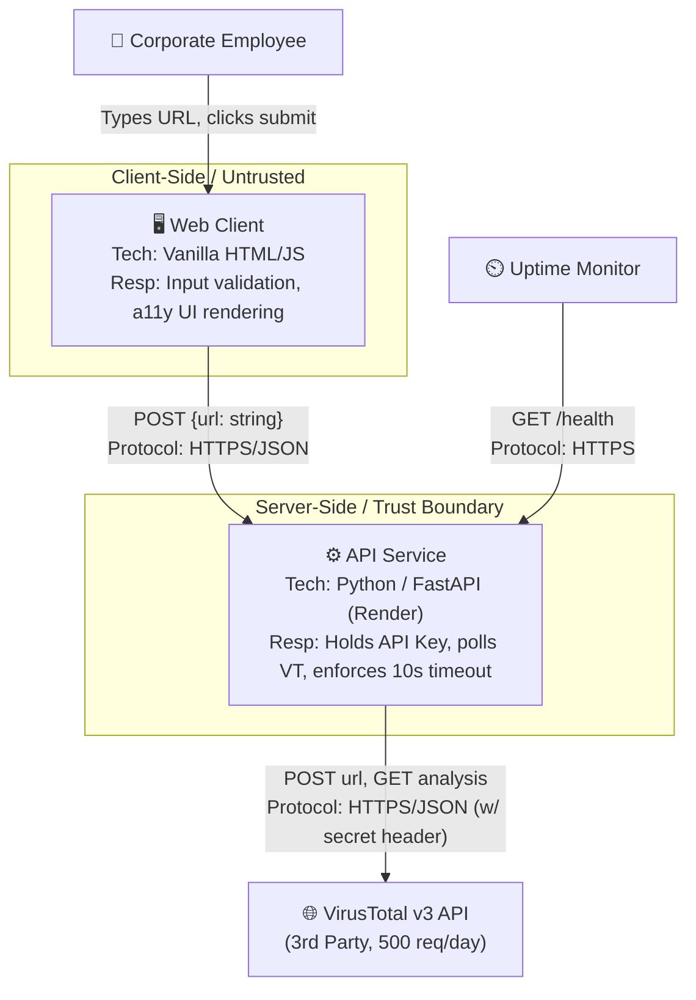
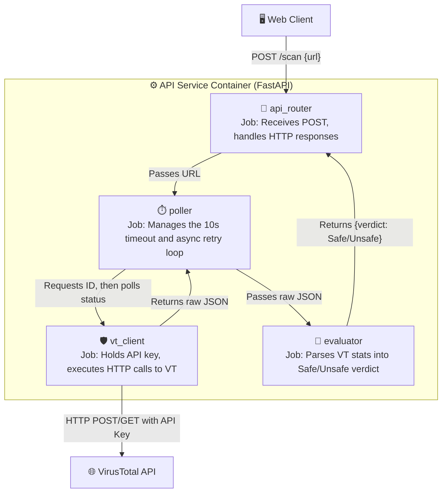

# 1. Decision Inventory (Rep 1)

| # | Requirement | Decision that must be made first | Section it belongs in |
|---|-------------|-----------------------------------|-----------------------|
| 1 | FR-INP-01 | What exact regex or parsing logic is used to define a standard domain format? | Components |
| 2 | FR-INP-03 / 04 | Does whitespace trimming and 2048-char validation happen mainly on the frontend, backend, or both? | Interface / Components |
| 3 | FR-EVAL-04 | When prepending `http://`, does the frontend update to show the user, or does it happen silently in the payload? | Interface / Sequence |
| 4 | FR-EVAL-01 | What specific thing defines a local intranet address? | Data / Components |
| 5 | FR-API-01 | When VirusTotal brings a 429 to the backend, does the backend give a 429 to the frontend, or a 200 with an error message? | Interface / Errors |
| 6 | FR-API-02 | Does the 10-second timeout clock live in the frontend `fetch` call, or the backend `requests` call? | Errors / Sequence |
| 7 | NFR-PERF-01 | VirusTotal v3 has a 2-step process. What is the exact delay between polling attempts to make sure I'm under the 10s budget? | Sequence / Errors |
| 8 | FR-DASH-01 | How does the frontend reliably pass the 3-second `setInterval` rotator if the network connection stops or times out? | Edge Cases |
| 9 | FR-UI-01 / 02 | What is the exact mathematical threshold from the VirusTotal JSON response that gives out the "Unsafe" state? | Data / Components |
| 10 | FR-SYS-01 / SEC-01 | How will the API key be safely loaded locally without accidentally committing it? | Context / Components |
| 11 | NFR-SEC-02 | Do I need to explicitly disable FastAPI's default access logging so user URLs aren't accidentally written to my server logs? | Data / Edge Cases |
| 12 | NFR-REL-01 | What specific endpoint will the ping service hit so I don't accidentally run through my 500/day VirusTotal quota on uptime checks? | Interface |
| 13 | NFR-ACC-02 | What specific HTML attribute is used to make the screen reader announce the async fetch completion? | Interface / UI |
| 14 | NFR-ACC-04 / 05 | What hex codes will be used for "Safe" (green) and "Unsafe" (red) to make sure I have a 4.5:1 contrast ratio? | Interface |
| 15 | NFR-PRI-01 | Where exactly in the DOM structure does the privacy disclaimer exist so it is not skipped by keyboard navigation? | Interface / UI |
| 16 | NFR-MNT-01 | Will the local setup instructions rely on standard `venv` and `pip`, or a different dependency manager to make sure it is able to be set up in less than 10 minutes? | Components |

# 2. Diagrams (Rep 2)

**Legend:** 
* User/Actor
* System / Container
* External / 3rd Party

# Level 1: Context Diagram
*Version 1.0 | Date: 2026-09-23*




# Rep 3: The Level-three Zoom

# Level 3: Component Diagram (API Service)
*Version 1.0 | Date: 2026-09-23*



# Component Responsibilities (Rep 4)

| Component | Responsibility (one sentence, starts with a verb) | Owns | Depends on | Serves |
|-----------|--------------------------------------------------|------|------------|--------|
| `input_validator` | Validates, trims, and formats the URL string before network transmission. | (none - stateless) | (none) | FR-INP-01, FR-INP-03, FR-INP-04, FR-EVAL-04, FR-EVAL-01 |
| `ui_controller` | Loads the loading states, error messages, and final safety verdict to the DOM. | UI DOM state | `input_validator`, `api_router` | FR-INP-02, FR-DASH-01, FR-UI-01, FR-UI-02, FR-API-01, FR-API-02, NFR-ACC-*, NFR-PRI-01 |
| `api_router` | Takes HTTP POST requests, validates payloads, and formats the final HTTP response. | (none - stateless) | `poller` | FR-SYS-01, CON-04 |
| `poller` | Runs the asynchronous wait-and-retry loop within the time limit. | 10-second timeout clock | `vt_client`, `evaluator` | NFR-PERF-01, FR-API-02 |
| `vt_client` | Authenticates and sends HTTP requests to the third-party threat database. | VirusTotal API Key | VirusTotal API | FR-SYS-01, NFR-SEC-01 |
| `evaluator` | Parses the third-party JSON responses and puts mathematical risk thresholds on them. | Scoring threshold rules | (none) | FR-UI-01, FR-UI-02 |
| `health_check` | Responds to monitoring pings without bringing in external API calls. | (none - stateless) | (none) | NFR-REL-01 |

**Audit:**
- **Verb test:** Every responsibility begins with an action verb (Validates, Loads, Takes, Runs, Authenticates, Parses, Responds). No "manages the" or "handles the".
- **Single-owner test:** The API key is owned by `vt_client`. The timeout clock is owned by `poller`. The DOM is owned by `ui_controller`. 
- **Cycle test:** Dependencies go one way: `ui_controller` ➔ `api_router` ➔ `poller` ➔ `vt_client` / `evaluator`. No cycles exist.
- **Traceability test:** Every Must-priority requirement from Week 4 is connected to at least one component, and every component serves at least one requirement.

# Interface Contracts (Rep 5)

## Rep 5 — Interface Contract
```text
POST /scan                                         (serves FR-INP-01, FR-SYS-01)
Auth     None; public-facing endpoint protected by rate limiting.
Request  { "url": string } required, 1-2048 chars, valid domain format.
Success  200 OK — { "url": "[http://example.com](http://example.com)", "verdict": "Safe", 
         "source": "virustotal", "scan_time_ms": 1240 }
         ("verdict" enum is strictly "Safe" | "Unsafe" | "Error")
Errors   400 malformed_url
         422 unscannable_intranet_address
         429 rate_limited
         500 internal_error
         504 gateway_timeout
         body: {"error":{"code":"...","field":"...","message":"..."}}
Idempotency  Fully idempotent; repeated calls return the same result, no state changes.
Writes   None; system is entirely stateless (CON-04, NFR-SEC-02).
Limits   Body <= 4 KB; execution time hard-capped at 10.0 seconds.
```

# Error Policy (Rep 6)
### Rep 6 — Error Policy
**Error envelope:**  
`{ "error": { "code": "...", "field": "...", "message": "..." } }`

**Codes I will use and what each means in MY system:**
* **400** `malformed_url` — The input is does not have a valid domain, contains spaces/IPs, or goes over 2048 characters.
* **401** `not_applicable` — (System has no authentication).
* **403** `not_applicable` — (System has no authorization).
* **404** `not_found` — Client tries to go to an unregistered route (anything other than `/scan` or `/health`).
* **409** `not_applicable` — (System is stateless; no database conflicts possible).
* **422** `unscannable_intranet` — URL is validly formatted but points to a local/intranet address.
* **429** `rate_limited` — The 500-request daily VirusTotal quota has been exhausted.
* **500** `internal_error` — Unhandled backend exception or crash.
* **504** `gateway_timeout` — The backend did not get a legit result from VirusTotal within the 10-second limit.

**What a user is shown for each, and what gets logged:**
* **400:** User sees "Malformed URL" or length error. Logged: `WARNING` with the rejected input.
* **404:** User sees generic "Page not found". Logged: `INFO` with the bad path.
* **422:** User sees "URL cannot be analyzed". Logged: `INFO` with the domain name.
* **429:** User sees "You have reached the daily request limit, please try again tomorrow." Logged: `ERROR` with VT quota alert.
* **500:** User sees "500 Error. Please try again." Logged: `ERROR` with the full stack trace (stack trace is NEVER sent to the client).
* **504:** User sees "Timeout: Analysis took too long. Please try again." Logged: `ERROR` with the elapsed time.

# Data Model (Rep 7)

**Constraint Override:** Per CON-04 (which says my project will have a stateless architecture) and NFR-SEC-02 (which takes 0 bytes of user history stored), this system has no persistent database. The following model shows the **transient, in-memory state** that is a thing only for the time of the HTTP request.

**Entity:** `scan_request` (serves FR-INP-01, FR-UI-01, FR-UI-02)
**Purpose:** Has the state of the URL scan in memory from request to response, then is immediately disposed of.
* `url`             text        NOT NULL  (The formatted URL string)
* `vt_analysis_id`  text        NULL      (The internal base64 ID returned by VT's first step. null = not yet sent)
* `malicious_hits`  integer     NOT NULL  (Default 0. Count of VT engines that flags a link as malicious)
* `verdict`         text        NOT NULL  enum: 'Safe' | 'Unsafe' | 'Error'

**Invariants:**
* **I1:** The `scan_request` object is gone immediately after returning the HTTP response; it is never written to disk (NFR-SEC-02).
* **I2:** `vt_analysis_id` is never logged to standard output to avoid accidental user history leakage.
* **I3:** `verdict` is strictly onto the enum; it is never free text.

**The Six Decisions (from Chapter 6):**
1. **Surrogate keys:** N/A (No persistent records).
2. **Timezones/UTC:** N/A (No dates are stored or evaluated).
3. **Money:** N/A.
4. **Enumerations:** `verdict` will only ever be 'Safe', 'Unsafe', or 'Error'.
5. **Deletion policy:** Hard delete (memory is freed automatically at the end of the Python request context).
6. **Nullability:** `vt_analysis_id` is null only if the first VirusTotal submission step has not yet gone through.

# 6. Sequence Flows (Rep 8)

## Flow 1 & 2: The Money Path & Risky Path (URL Scan)
(Serves FR-INP-01, FR-DASH-01, FR-UI-01)

1. **Client** POSTs `{ "url": "http://example.com" }` to API Service.
2. **API Service** validates, trims whitespace, and enforces the 2048-char limit.
3. **API Service** POSTs the URL to VirusTotal using my secret API Key.
4. **VirusTotal** brings back a 200 OK with an `id` (the analysis ID).
5. **API Service** starts a polling loop: GET to VirusTotal (`/api/v3/analyses/{id}`).
6. **VirusTotal** returns `{"status": "completed", "stats": {"malicious": 0}}`.
7. **API Service** evaluates the stats against the threshold (malicious > 0).
8. **API Service** returns `200 OK` with `{"verdict": "Safe"}` to Client.
9. **Client** takes out the spinning wheel and gives the green "Safe" UI.

## Flow 3: The Failure Branch (VirusTotal Delays/Fails)
(Serves FR-API-01, FR-API-02)

| Step | What can go wrong | System behavior | User sees |
|------|-------------------|-----------------|-----------|
| 1 | URL goves over 2048 chars or is malformed | Reject immediately before network I/O; return 400. | "Malformed URL" or length error. |
| 3 | VT gives a 429 Rate Limit on first submit | Abort process; log ERROR; return 429. | "You have reached the daily request limit, please try again tomorrow." |
| 4 | VT gives a 500 Internal Server Error | Abort process; log ERROR; return 500. | "500 Error. Please try again." |
| 6 | VT gives a `{"status": "queued"}` over and over | Continue polling until the 10.0-second clock expires. | Spinning wheel / local security tips. |
| 6b | 10.0 seconds elapse and VT is still "queued" | Break the loop; abort request; return 504. | "Timeout: Analysis took too long. Please try again." |

# Migration Plan (Rep 9)
1. **Migration mechanism:** An empty SQL file with a documentation header, making sure no automated CI/CD pipeline ever attempts to start a database.
2. **Forward-only or reversible:** N/A (Stateless).
3. **Path and runner:** `migrations/0001-stateless.sql`, checked by the Week 14 setup script to make sure no tables are created.