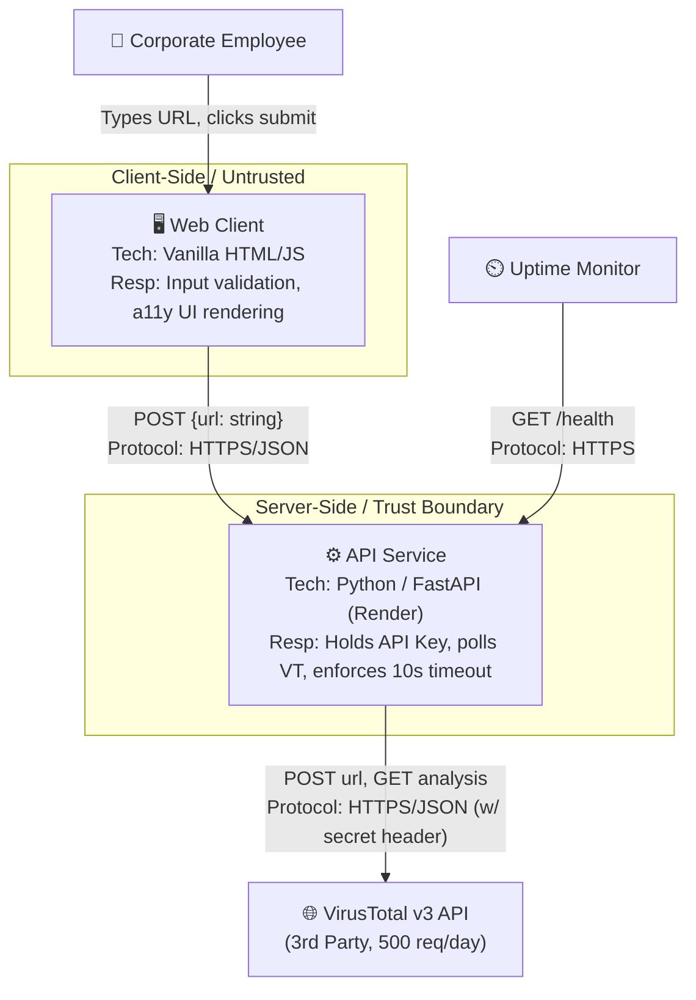
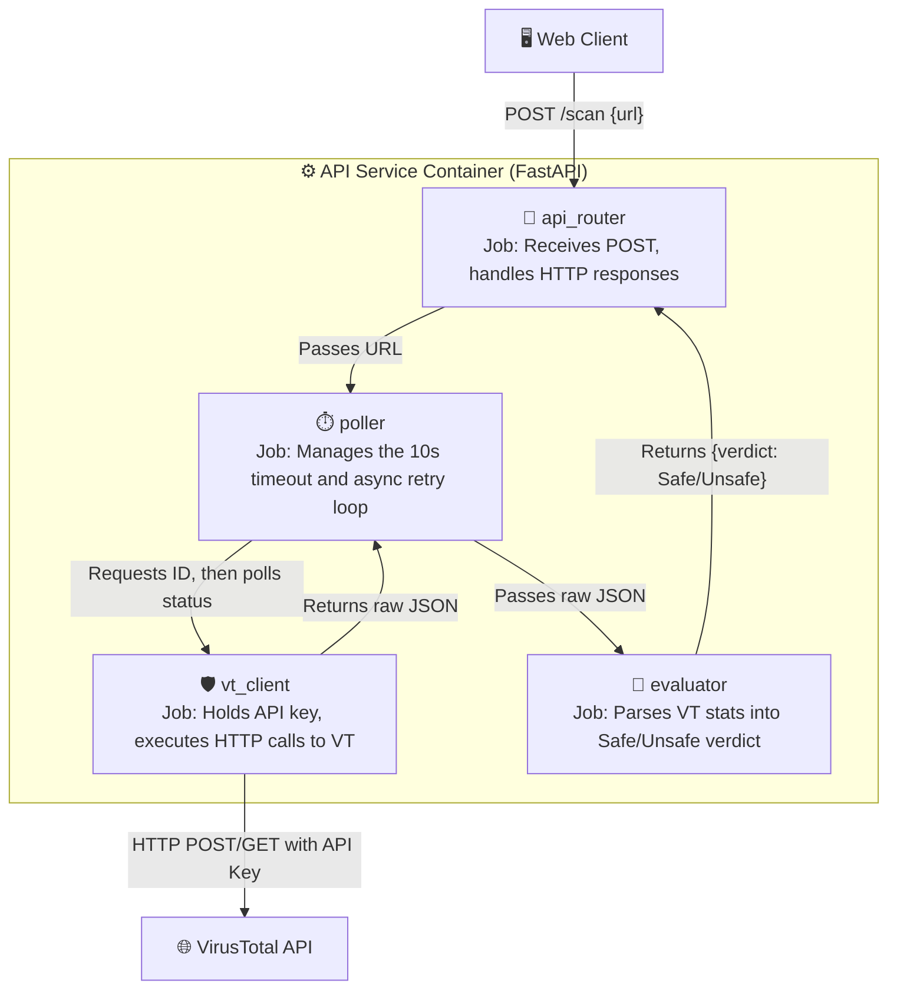

# 1. Decision Inventory (Rep 1)

| # | Requirement | Decision that must be made first | Section it belongs in |
|---|-------------|-----------------------------------|-----------------------|
| 1 | FR-INP-01 | What exact regex or parsing logic is used to define a standard domain format? | Components |
| 2 | FR-INP-03 / 04 | Does whitespace trimming and 2048-char validation happen mainly on the frontend, backend, or both? | Interface / Components |
| 3 | FR-EVAL-04 | When prepending `http://`, does the frontend update to show the user, or does it happen silently in the payload? | Interface / Sequence |
| 4 | FR-EVAL-01 | What specific thing defines a local intranet address? | Data / Components |
| 5 | FR-API-01 | When VirusTotal brings a 429 to the backend, does the backend give a 429 to the frontend, or a 200 with an error message? | Interface / Errors |
| 6 | FR-API-02 | Does the 10-second timeout clock live in the frontend `fetch` call, or the backend `requests` call? | Errors / Sequence |
| 7 | NFR-PERF-01 | VirusTotal v3 has a 2-step process. What is the exact delay between polling attempts to make sure I'm under the 10s budget? | Sequence / Errors |
| 8 | FR-DASH-01 | How does the frontend reliably pass the 3-second `setInterval` rotator if the network connection stops or times out? | Edge Cases |
| 9 | FR-UI-01 / 02 | What is the exact mathematical threshold from the VirusTotal JSON response that gives out the "Unsafe" state? | Data / Components |
| 10 | FR-SYS-01 / SEC-01 | How will the API key be safely loaded locally without accidentally committing it? | Context / Components |
| 11 | NFR-SEC-02 | Do I need to explicitly disable FastAPI's default access logging so user URLs aren't accidentally written to my server logs? | Data / Edge Cases |
| 12 | NFR-REL-01 | What specific endpoint will the ping service hit so I don't accidentally run through my 500/day VirusTotal quota on uptime checks? | Interface |
| 13 | NFR-ACC-02 | What specific HTML attribute is used to make the screen reader announce the async fetch completion? | Interface / UI |
| 14 | NFR-ACC-04 / 05 | What hex codes will be used for "Safe" (green) and "Unsafe" (red) to make sure I have a 4.5:1 contrast ratio? | Interface |
| 15 | NFR-PRI-01 | Where exactly in the DOM structure does the privacy disclaimer exist so it is not skipped by keyboard navigation? | Interface / UI |
| 16 | NFR-MNT-01 | Will the local setup instructions rely on standard `venv` and `pip`, or a different dependency manager to make sure it is able to be set up in less than 10 minutes? | Components |

# 2. Diagrams (Rep 2)

**Legend:** 
* User/Actor
* System / Container
* External / 3rd Party

# Level 1: Context Diagram
*Version 1.0 | Date: 2026-09-23*

# Rep 3: The Level-three Zoom

# Level 3: Component Diagram (API Service)
*Version 1.0 | Date: 2026-09-23*

# Component Responsibilities (Rep 4)

| Component | Responsibility (one sentence, starts with a verb) | Owns | Depends on | Serves |
|-----------|--------------------------------------------------|------|------------|--------|
| `input_validator` | Validates, trims, and formats the URL string before network transmission. | (none - stateless) | (none) | FR-INP-01, FR-INP-03, FR-INP-04, FR-EVAL-04, FR-EVAL-01 |
| `ui_controller` | Loads the loading states, error messages, and final safety verdict to the DOM. | UI DOM state | `input_validator`, `api_router` | FR-INP-02, FR-DASH-01, FR-UI-01, FR-UI-02, FR-API-01, FR-API-02, NFR-ACC-*, NFR-PRI-01 |
| `api_router` | Takes HTTP POST requests, validates payloads, and formats the final HTTP response. | (none - stateless) | `poller` | FR-SYS-01, CON-04 |
| `poller` | Runs the asynchronous wait-and-retry loop within the time limit. | 10-second timeout clock | `vt_client`, `evaluator` | NFR-PERF-01, FR-API-02 |
| `vt_client` | Authenticates and sends HTTP requests to the third-party threat database. | VirusTotal API Key | VirusTotal API | FR-SYS-01, NFR-SEC-01 |
| `evaluator` | Parses the third-party JSON responses and puts mathematical risk thresholds on them. | Scoring threshold rules | (none) | FR-UI-01, FR-UI-02 |
| `health_check` | Responds to monitoring pings without bringing in external API calls. | (none - stateless) | (none) | NFR-REL-01 |

**Audit:**
- **Verb test:** Every responsibility begins with an action verb (Validates, Loads, Takes, Runs, Authenticates, Parses, Responds). No "manages the" or "handles the".
- **Single-owner test:** The API key is owned by `vt_client`. The timeout clock is owned by `poller`. The DOM is owned by `ui_controller`. 
- **Cycle test:** Dependencies go one way: `ui_controller` ➔ `api_router` ➔ `poller` ➔ `vt_client` / `evaluator`. No cycles exist.
- **Traceability test:** Every Must-priority requirement from Week 4 is connected to at least one component, and every component serves at least one requirement.
