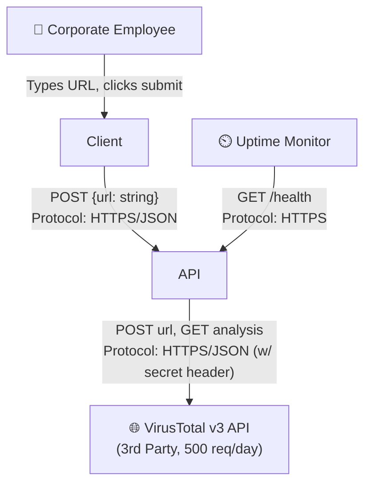

# Technical Specification — URL Security Scanner

Version: v0.1   Date: 2026-09-28   Author: Caleb Fuller   Status: Draft
Requirements baseline this design satisfies: docs/requirements.md v1.0

## 1. Purpose and Scope
This system is a strictly stateless, zero-budget web application that allows corporate employees to verify the safety of URLs. 
* **In scope:** URL string validation (FR-INP-01 to 04), asynchronous 3rd-party polling (FR-SYS-01, FR-API-01, 02), Safe/Unsafe UI state management (FR-UI-01, 02), and accessibility compliance (NFR-ACC-*).
* **Out of scope:** Database persistence, user accounts, and scan history logs. 

## 2. System Context (Level 1)
Diagram: `docs/diagrams/context.mmd`

```mermaid
graph TD
    User["👤 Corporate Employee"]
    VT["🌐 VirusTotal v3 API<br/>(3rd Party, 500 req/day)"]
    Ping["⏲️ Uptime Monitor"]

    User -- "Types URL, clicks submit" --> Client
    Client -- "POST {url: string}<br/>Protocol: HTTPS/JSON" --> API
    API -- "POST url, GET analysis<br/>Protocol: HTTPS/JSON (w/ secret header)" --> VT
    Ping -- "GET /health<br/>Protocol: HTTPS" --> API
```

| External actor / system | What it does with us | Protocol | If it is unavailable |
|---|---|---|---|
| **Corporate Employee** | Submits URLs via browser | HTTPS | N/A |
| **VirusTotal v3 API** | Evaluates URL risk | HTTPS / REST | Backend aborts immediately, returns 500/504 to client |
| **Uptime Monitor** | Pings server to prevent cold sleep | HTTPS | Initial scans suffer 50s Render cold-start penalty |

## 3. Containers (Level 2)
| Container | Responsibility (one sentence) | Technology | Runs where | Holds secrets? |
|---|---|---|---|---|
| **Web Client** | Input validation, a11y UI rendering | Vanilla HTML/JS | Client-Side / Untrusted | No |
| **API Service** | Holds API Key, polls VT, enforces 10s timeout | Python / FastAPI (Render) | Server-Side / Trust Boundary | Yes |

**Trust boundary:** The client-side is untrusted. The API Service container acts as the trust boundary where the API key is held and never exposed to the client.

## 4. Components (Level 3 — API Service)
Diagram: `docs/diagrams/level-3-components.mmd`

| Component | Responsibility (verb first) | Owns (state) | Depends on | Serves (req IDs) |
|---|---|---|---|---|
| `input_validator` | Validates, trims, and formats the URL string before network transmission. | (none - stateless) | (none) | FR-INP-01, FR-INP-03, FR-INP-04, FR-EVAL-04, FR-EVAL-01 |
| `ui_controller` | Loads the loading states, error messages, and final safety verdict to the DOM. | UI DOM state | `input_validator`, `api_router` | FR-INP-02, FR-DASH-01, FR-UI-01, FR-UI-02, FR-API-01, FR-API-02, NFR-ACC-*, NFR-PRI-01 |
| `api_router` | Takes HTTP POST requests, validates payloads, and formats the final HTTP response. | (none - stateless) | `poller` | FR-SYS-01, CON-04 |
| `poller` | Runs the asynchronous wait-and-retry loop within the time limit. | 10-second timeout clock | `vt_client`, `evaluator` | NFR-PERF-01, FR-API-02 |
| `vt_client` | Authenticates and sends HTTP requests to the third-party threat database. | VirusTotal API Key | VirusTotal API | FR-SYS-01, NFR-SEC-01 |
| `evaluator` | Parses the third-party JSON responses and puts mathematical risk thresholds on them. | Scoring threshold rules | (none) | FR-UI-01, FR-UI-02 |
| `health_check` | Responds to monitoring pings without bringing in external API calls. | (none - stateless) | (none) | NFR-REL-01 |

* **Dependency graph is acyclic:** Yes, dependencies go one way: `ui_controller` ➔ `api_router` ➔ `poller` ➔ `vt_client` / `evaluator`. No cycles exist.
* **Every piece of state has exactly one owner:** Yes, the API key is owned by `vt_client`. The timeout clock is owned by `poller`. The DOM is owned by `ui_controller`.

## 5. Interface Contracts

### POST /scan                                         (serves FR-INP-01, FR-SYS-01)
**Purpose**      Accepts a URL from the client, coordinates the asynchronous VirusTotal risk analysis, and returns a safe/unsafe verdict.
**Auth**         None; public-facing endpoint protected by rate limiting.
**Request**      `{ "url": string }` required, 1-2048 chars, valid domain format.
**Success**      200 OK — `{ "url": "http://example.com", "verdict": "Safe", "source": "virustotal", "scan_time_ms": 1240 }`
**Errors**       400 malformed_url, 422 unscannable_intranet_address, 429 rate_limited, 500 internal_error, 504 gateway_timeout
**Idempotency**  Fully idempotent; repeated calls return the same result, no state changes.
**Side effects** None; system is entirely stateless (CON-04, NFR-SEC-02).
**Limits**       Body <= 4 KB; execution time hard-capped at 10.0 seconds.

**Error envelope used system-wide:** `{ "error": { "code": "...", "field": "...", "message": "..." } }`
**Status-code policy:**
* **400** `malformed_url` — The input is does not have a valid domain, contains spaces/IPs, or goes over 2048 characters.
* **422** `unscannable_intranet` — URL is validly formatted but points to a local/intranet address.
* **429** `rate_limited` — The 500-request daily VirusTotal quota has been exhausted.
* **500** `internal_error` — Unhandled backend exception or crash.
* **504** `gateway_timeout` — The backend did not get a legit result from VirusTotal within the 10-second limit.

## 6. Data Model
*Constraint Override: Per CON-04 (which says my project will have a stateless architecture) and NFR-SEC-02 (which takes 0 bytes of user history stored), this system has no persistent database. The following model shows the transient, in-memory state that is a thing only for the time of the HTTP request.*

### Entity: scan_request                                 (serves FR-INP-01, FR-UI-01, FR-UI-02)
**Purpose**        Has the state of the URL scan in memory from request to response, then is immediately disposed of.
  `url`            text     NOT NULL  (The formatted URL string)
  `vt_analysis_id` text     NULL      (The internal base64 ID returned by VT's first step. null = not yet sent)
  `malicious_hits` integer  NOT NULL  (Default 0. Count of VT engines that flags a link as malicious)
  `verdict`        text     NOT NULL  (enum: 'Safe' | 'Unsafe' | 'Error')
**Invariants**     I1: The `scan_request` object is gone immediately after returning the HTTP response; it is never written to disk (NFR-SEC-02). I2: `vt_analysis_id` is never logged to standard output to avoid accidental user history leakage. I3: `verdict` is strictly onto the enum; it is never free text.
**Relationships**  None
**Volume**         ~500 transient rows/day (max quota). 0 persistent rows.
**Lifecycle**      Created on request; memory is freed automatically at the end of the Python request context.

### Migrations
**Mechanism**      An empty SQL file with a documentation header, making sure no automated CI/CD pipeline ever attempts to start a database.
**Direction**      N/A (Stateless).
**Path + runner**  `migrations/0001-stateless.sql`, checked by the Week 14 setup script to make sure no tables are created.
**Conventions**    `verdict` will only ever be 'Safe', 'Unsafe', or 'Error'.

## 7. Sequence Flows

### Flow 1 & 2 — The Money Path & Risky Path (URL Scan) (serves FR-INP-01, FR-DASH-01, FR-UI-01)
1. **Client** POSTs `{ "url": "http://example.com" }` to API Service.
2. **API Service** validates, trims whitespace, and enforces the 2048-char limit.
3. **API Service** POSTs the URL to VirusTotal using my secret API Key.
4. **VirusTotal** brings back a 200 OK with an `id` (the analysis ID).
5. **API Service** starts a polling loop: GET to VirusTotal (`/api/v3/analyses/{id}`).
6. **VirusTotal** returns `{"status": "completed", "stats": {"malicious": 0}}`.
7. **API Service** evaluates the stats against the threshold (malicious > 0).
8. **API Service** returns `200 OK` with `{"verdict": "Safe"}` to Client.
9. **Client** takes out the spinning wheel and gives the green "Safe" UI.

### Flow 3 — The Failure Branch (VirusTotal Delays/Fails) (serves FR-API-01, FR-API-02)
| Step | What can go wrong | System behavior | User sees |
|---|---|---|---|
| 1 | URL goves over 2048 chars or is malformed | Reject immediately before network I/O; return 400. | "Malformed URL" or length error. |
| 3 | VT gives a 429 Rate Limit on first submit | Abort process; log ERROR; return 429. | "You have reached the daily request limit, please try again tomorrow." |
| 4 | VT gives a 500 Internal Server Error | Abort process; log ERROR; return 500. | "500 Error. Please try again." |
| 6 | VT gives a `{"status": "queued"}` over and over | Continue polling until the 10.0-second clock expires. | Spinning wheel / local security tips. |
| 6b | 10.0 seconds elapse and VT is still "queued" | Break the loop; abort request; return 504. | "Timeout: Analysis took too long. Please try again." |

## 8. Error Handling and Edge Cases

| Category | Policy |
|---|---|
| **Invalid input** | Reject at the FastAPI boundary before any network I/O. Return 400. |
| **Not authorized**| Catch VT's 401, log a CRITICAL alert, and return a generic 500 to the user. |
| **Not found** | Standard 404 response. |
| **Conflict** | (Not applicable) System is stateless; no database conflicts can happen. |
| **Dependency failure**| Immediate abort; no retries to save time. Log error, send 504 Gateway Timeout or 500. |
| **Exhaustion** | Detect VT's 429 response and tell the user to try again tomorrow via 429. |

**For every call that leaves this process:**
| Call | Timeout (s) | Retries + backoff | Fallback | User is told? |
|---|---|---|---|---|
| `POST` & `GET` to VirusTotal API (`vt_client`) | 3.0 | 0 (1 immediate if network drops) | Immediate abort | Yes, explicit timeout message. |

**Edge-case register:**
| # | Edge case | Expected behavior |
|---|---|---|
| 1 | **Empty state:** User clicks submit with a blank field. | Frontend stops the request and displays "Blank field" error (FR-INP-02). |
| 2 | **Render Cold Start:** Backend is asleep and takes 50 seconds to boot up. | Frontend `fetch` timeout is set to 60s to allow the initial wake-up, but the backend still enforces its 10s VT timeout once awake. |
| 3 | **Whitespace URL:** `  http://example.com  ` | Leading/trailing spaces trimmed prior to validation (FR-INP-04). |
| 4 | **No protocol:** `example.com` | System prepends `http://` before scanning (FR-EVAL-04). |
| 5 | **Intranet URL:** `http://192.168.1.1` | Blocked by backend, brings back 422 (FR-EVAL-01). |
| 6 | **Exactly 2048 chars:** URL is exactly the max length. | Accepted and passed to VirusTotal successfully. |
| 7 | **Exactly 2049 chars:** URL is 1 character over max. | Blocked by frontend and backend; returns 400 Bad Request (FR-INP-03). |
| 8 | **Double submit:** User double-clicks "Submit" rapidly. | Frontend gets rid of the submit button on the first click until the request resolves. |
| 9 | **Emoji/Unicode URL:** `http://😂.ws` | Parsed via Punycode conversion or not accepted safely as malformed without crashing backend. |
| 10 | **VT Free Tier Exhaustion:** We hit the 501st request. | VT returns 429, backend catches it and returns 429 to client (FR-API-01). |
| 11 | **VT Queued Forever:** VT takes 15s to analyze a new URL. | Backend strictly breaks the loop at 10.0s and returns 504 (FR-API-02). |
| 12 | **Network Drop:** User loses Wi-Fi while waiting for result. | Frontend catches the failed `fetch` and displays a local connection error. |

## 9. External and Nondeterministic Dependencies

**Dependency:** VirusTotal v3 API (`vt_client`)

| Fact | Value | Source URL | Date checked |
|---|---|---|---|
| **What we call** | `/api/v3/urls` & `/api/v3/analyses/{id}` | docs.virustotal.com | 2026-09-24 |
| **Cost** | $0 (Free Tier) | virustotal.com/gui/user/... | 2026-09-24 |
| **Limits** | 500 requests / day, 4 requests / minute | docs.virustotal.com | 2026-09-24 |
| **If down** | Backend aborts immediately (3s HTTP timeout), returns 504. | (Architectural decision) | 2026-09-25 |

### The Betrayals (Failure Modes)
As an external, unowned network dependency, the VirusTotal API can go against this stateless system in three primary ways:
1. **Quota Exhaustion (The 429 Betrayal):** The free tier only permits 500 requests per day. A sudden spike in corporate usage will hault the app.
2. **The Infinite Hang (The Timeout Betrayal):** VirusTotal's servers could take the TCP connection but never give a response, locking up my backend's worker thread.
3. **Schema Drift (The Payload Betrayal):** VirusTotal could rename the `stats.malicious` JSON key to `data.attributes.last_analysis_stats.malicious` without warning, making a `KeyError` in my Python evaluator.

### The Mitigations
1. **Mitigating Exhaustion:** The backend is programmed to catch HTTP 429 responses from VirusTotal. Rather than crashing, it degrades by returning a 429 to the frontend, which renders the exact string: *"You have reached the daily request limit, please try again tomorrow."* (FR-API-01).
2. **Mitigating Hangs:** The `vt_client` will pass `timeout=3.0` to the Python `requests` library for every individual network call. If the request stalls, it aborts immediately locally rather than exhausting the 10-second global clock (FR-API-02).
3. **Mitigating Schema Drift:** The backend will use Pydantic models (or strict `dict.get()` fallbacks) to parse the JSON. If the expected structure is missing, the system catches the `ValidationError`, logs a critical parsing error, and brings back a 500 Internal Error instead of crashing the server thread.

## 10. Traceability

| Requirement | Priority | Component(s) | Interface(s) | Flow |
|---|---|---|---|---|
| **FR-INP-01** | Must | `input_validator`, `ui_controller` | `POST /scan` | Flow 1 |
| **FR-INP-02** | Must | `ui_controller` | `POST /scan` | Edge Case 1 |
| **FR-INP-03** | Must | `input_validator` | `POST /scan` | Edge Case 7 |
| **FR-INP-04** | Must | `input_validator` | `POST /scan` | Edge Case 3 |
| **FR-EVAL-01** | Must | `input_validator` | `POST /scan` | Edge Case 5 |
| **FR-API-01** | Must | `ui_controller`, `vt_client` | `POST /scan` | Flow 3 |
| **FR-API-02** | Must | `poller`, `ui_controller` | `POST /scan` | Flow 3 |
| **FR-SYS-01** | Must | `api_router`, `vt_client` | `POST /scan` | Flow 1 |
| **FR-UI-01** | Must | `evaluator`, `ui_controller` | `POST /scan` | Flow 1 |
| **NFR-SEC-01** | Must | `vt_client` | `POST /scan` | Context |
| **NFR-REL-01** | Must | `health_check` | `GET /health` | Context |
| **FR-ACT-01** | Must | `ui_controller` | `POST /scan` | Context |
| **FR-DASH-02** | Must | `ui_controller` | `POST /scan` | Context |
| **FR-DASH-03** | Must | `ui_controller` | `POST /scan` | Context |
| **FR-EVAL-02** | Must | `evaluator` | `POST /scan` | Flow 1 |
| **FR-EVAL-03** | Must | `evaluator` | `POST /scan` | Flow 1 |
| **FR-SYS-02** | Must | `api_router` | `POST /scan` | Context |
| **NFR-ACC-01** | Must | `ui_controller` | `POST /scan` | Context |
| **NFR-ACC-02** | Must | `ui_controller` | `POST /scan` | Context |
| **NFR-ACC-03** | Must | `ui_controller` | `POST /scan` | Context |
| **NFR-ACC-04** | Must | `ui_controller` | `POST /scan` | Context |
| **NFR-ACC-05** | Must | `ui_controller` | `POST /scan` | Context |
| **NFR-MNT-01** | Must | (Architecture) | N/A | N/A |
| **NFR-USE-01** | Must | `ui_controller` | `POST /scan` | Context |

## 11. Open Questions and Design Risks
| # | Open question | What it blocks | Owner | Decide by |
|---|---|---|---|---|
| 1 | *None at this time.* | | | |

## 12. Change Log for This Document
| Version | Date | Change | Why |
|---|---|---|---|
| v0.1 | 2026-09-28 | Initial draft assembled (Reps 1-12) | Completion of Milestone 6 |